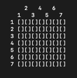
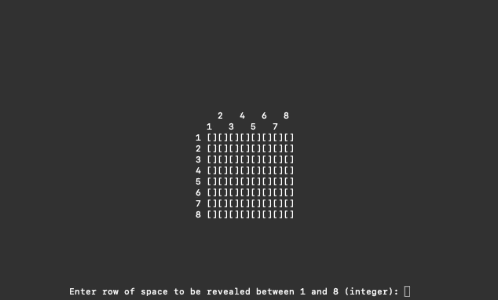

# MineSeeper

_Command line adaptation of MineSweeper_

<br>

<p align="center">
  <a href="https://github.com/sam-parsons/MineSeeper">
    
  </a>
</p>

<a href="https://sam-parsons.github.io/MineSeeper">
  
</a>

<br>
<br>

## Installation

```sh
git clone https://github.com/sam-parsons/MineSeeper.git

cd MineSeeper/

javac LA1Main

java LA1Main
```

## Features

- Customizable minefields
- Variable field size
- Variable difficulty
